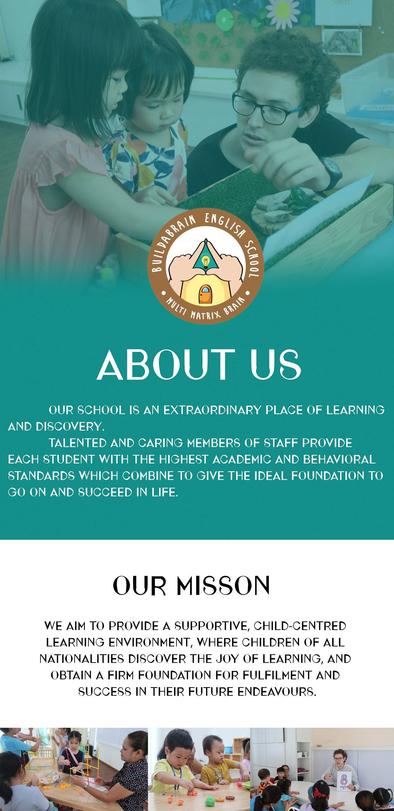

# Buildabrain Learning Center

Buildabrain is a cross-platform management application for a learning center used to coordinate students, setup schedules for teachers and parents as well as a payment system. 
 
  
 
## Framework and design
  * **Color scheme**\
    Paletton is an online application located on the internet at Paletton.com. It provides powerfull tool to create color combinations and palettes of colors that work together well. The major advantage of Paletton is it's not using the modern computer and engineering RGB color space, but it's built on a classical artistic color wheel, applies classical color theory and works within a specially created RYB color space. Therefore the color combinations it produces are very different from those you can get in many computer graphic applications.\
    

  * **Minimize Cognitive Load**\
Cognitive load refers here to the amount of brain power required to use the app. The human brain has a limited amount of processing power, and when an app provides too much information at once, it might overwhelm the user and make them abandon the task.
  * **Visual consistency**\
  Consistency is a fundamental principle of UX design. When things work in the way users predict, they feel a stronger sense of control. Unlike on desktop, where users can use hover effects to understand whether something is interactive or not, on mobile, users can check interactivity only by tapping on an element. That’s why, with buttons and other interactive elements, it’s essential to think about how the design communicates affordance.\

## **Funtionality** 
  * Buildabrain is a cross-platform management system designed to manage certain activities at a small to medium sized learning center. As a teacher, you could add lesson plans, chat with parents and give reports and tests to students. As a parent you could add your child's information, view your child's progress and make payments from the application. 

  The parent home screen where you could find certain subjects and lesson plans.
  
   
  
  The student information page where you could find basic info as well as student progress.
  
  
  
  The schedule page where you could find holidays, which days each subject is taught and keep track how many lessons are available.
  
    
  

## **Authentication protocol**
* **Drop-in authentication solution** 

FirebaseUI provides a drop-in auth solution that handles the UI flows for signing in users with email addresses and passwords, phone numbers, and with popular federated identity providers, including Google Sign-In and Facebook Login.
The FirebaseUI Auth component implements best practices for authentication on mobile devices and websites, which can maximize sign-in and sign-up conversion for your app. It also handles edge cases like account recovery and account linking that can be security sensitive and error-prone to handle correctly.

### How does it work? 

You first get authentication credentials from the user. These credentials can be the user's email address and password, or an OAuth token from a federated identity provider. Then, you pass these credentials to the Firebase Authentication SDK. The backend services will then verify those credentials and return a response to the client.

 

## **Storage management and CRUD functions**
* **Google Cloud Firestore**\
Cloud Firestore is a flexible, scalable database for mobile, web, and server development from Firebase and Google Cloud Platform. Like Firebase Realtime Database, it keeps your data in sync across client apps through realtime listeners and offers offline support for mobile and web so you can build responsive apps that work regardless of network latency or Internet connectivity. Cloud Firestore also offers seamless integration with other Firebase and Google Cloud Platform products, including Cloud Functions.

## **Architecture and technologies**
This project is implemented using the following technologies:
* Flutter
* Firebase API
* Firestore
